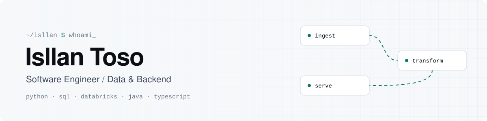

<picture>
  <source media="(prefers-color-scheme: dark)" srcset="./assets/header-dark.svg">
  
</picture>

Full-stack developer building web apps, APIs and desktop tools, from database schema to UI. Software developer at **Globalsys**. Before that, three years of freelance delivery, including a multi-tenant SaaS for vehicle dealerships that runs in production.

[isllan.dev](https://isllan.dev) · [LinkedIn](https://www.linkedin.com/in/isllantoso/)

### Now

- Shipping backend services and integrations at Globalsys (Python, SQL, Databricks)
- B.Sc. Computer Science at UVV, graduating 2027
- Exploring Rust for desktop tooling

### Stack

| Area | Tools |
|---|---|
| Languages | TypeScript · Python · Java · SQL |
| Frontend | React · Angular · Tailwind · Vite |
| Backend | Node.js · FastAPI · Spring Boot · REST |
| Databases | PostgreSQL · MongoDB · Redis |
| Tooling | Docker · Git · Linux · Azure DevOps |

### Selected work

| Project | What it does | Stack |
|---|---|---|
| [Estoquei](https://github.com/Isllanrx/Estoquei) | Messaging platform with JWT auth, real-time chat and media sharing | Angular · Node.js · MongoDB |
| [webp-converter-tool](https://github.com/Isllanrx/webp-converter-tool) | Batch image conversion to WebP in the browser, with ZIP export | React · TypeScript |
| [vehicle-contract-generator](https://github.com/Isllanrx/vehicle-contract-generator) | Desktop app that generates validated, password-protected PDF contracts | Python |
| [local-llm-lab](https://github.com/Isllanrx/local-llm-lab) | Desktop client for local LLMs via Ollama, with persistent sessions | Python |
| [analytics-converter](https://github.com/Isllanrx/analytics-converter) | Converts CSV to Parquet, ORC, Feather and HDF5 | Python · PyArrow |
